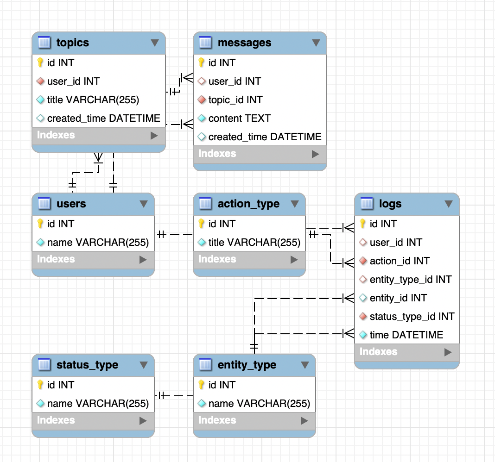

# data_engineer_Kan_Erik

## Описание проекта
Этот проект предназначен для работы с логами форума. Он включает инструменты для наполнения базы данных, очистки данных, анализа логов и развертывания с помощью Docker.

## Установка и запуск
### 1. Запуск через Docker (если используется)
Склонируйте репозиторий и перейдите в директорию проекта:
```
git clone https://github.com/kand11/data_engineer_Kan_Erik.git
```

Создайте и активируйте виртуальное окружение:
```sh
python -m venv venv
source venv/bin/activate  # Linux/macOS
venv\Scripts\activate     # Windows
```
Установите зависимости:
```sh
pip install -r requirements.txt
```
Запустите docker-контейнер:
```sh
docker-compose up -d
```
Перейдите в docker-контейнер и создайте базу данных для восстановления:
```
docker exec -it mysql_db mysql -uuser -ppassword
create database forum_logs_db;
exit;
```
Скопируйте дамп базы данных на docker-контейнер:
```sh
docker cp Dump.sql mysql_db:/dump.sql
```
Восстановите базу данных:
```
docker exec -i mysql_db mysql -uuser -ppassword forum_logs_db < dump.sql
```

### 2. Заполнение базы данных
```sh
python fill_db.py
```

### 3. Анализ данных
```sh
python analize_data.py
```
Данные сохраняются в `aggregated_data.csv`.

### 4. Очистка базы данных (если необходимо)
```sh
python drop_data.py
```

## Схема базы данных


### Какие данные уже в таблицах:
#### action_type
- first_visit (Первый заход на сайт)
- registration (Регистрация)
- login (Логин)
- logout (Логаут)
- create_topic (Создание темы)
- view_topic (Просмотр темы)
- delete_topic (Удаление темы)
- write_message (Написание сообщения)

#### status_type 
- success (Успех)
- error (Ошибка)

#### entity_type 
- topic (Тема)
- message (Сообщение)

### Почему выбран такой подход в создании БД:
- Привязка конкретной темы или сообщения в logs с помощью entity_id.
- Гибкость: можно добавлять новые действия (action_type) и статусы (status_type) без изменения структуры.
  - При добавлении как-либо новых сущностей (реакции на посты, комментарии) с помощью entity_type структура останется почти неизменной.
- Оптимизация по памяти: вместо хранения длинных строк в логах, используются ссылки на INT ID.
- Простота анализа данных: удобно агрегировать статистику по logs, topics, messages.
- Целостность данных: каскадные связи (ON DELETE CASCADE / SET NULL) обеспечивают правильное удаление данных.


